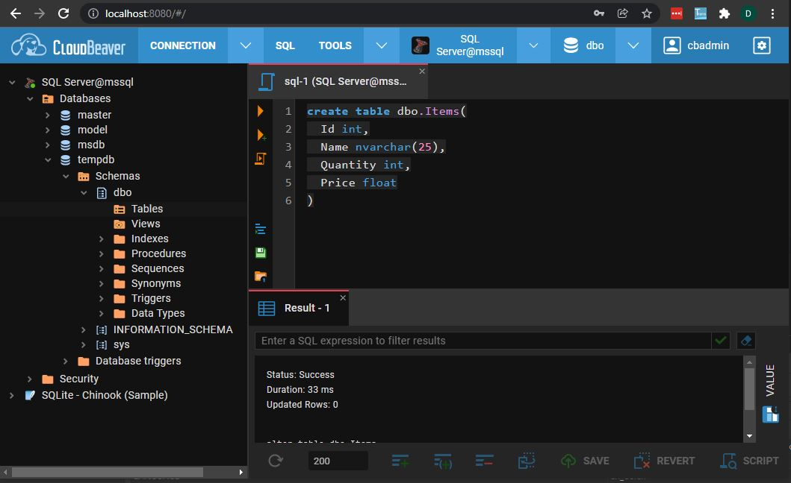

### MsSQL DB Connector
by Denny Imanuel

This mini project showcase how to connect to Microsoft SQL DB using CSharp programming language.
You don't need physical database to test the code. We'll use Docker Compose to create database container.

### Run DB Container

First you need to run MsSQL DB container and Cloudbeaver container using following command:

    docker-compose up

Browse Cloudbeaver portal at http://localhost:8080 and manually setup connection to
MsSQL DB:

        user: SA        
        password: ABCabc123!

### Test DB Connector

Finally you can test connection to MsSQL DB via following CSharp connector module:

    MsSqlConnector.cs
